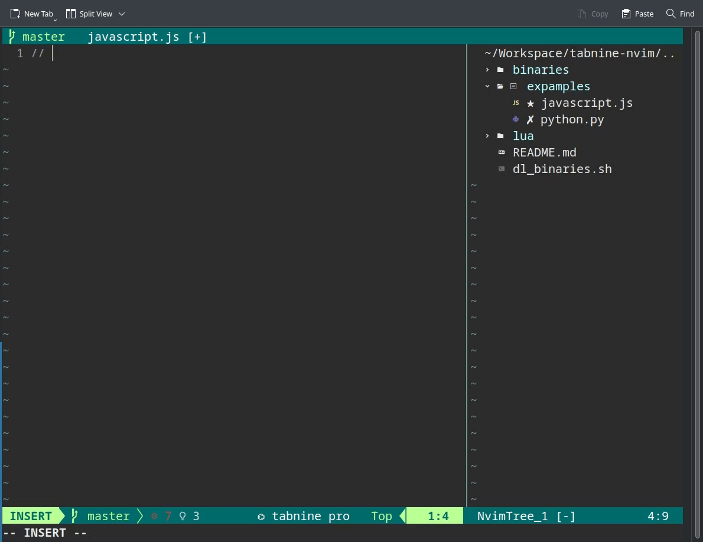

# tabnine-nvim

Tabnine client for neovim



## Install

Using [vimplug](https://github.com/junegunn/vim-plug)

```
Plug 'codota/tabnine-nvim', { 'do': './dl_binaries.sh' }
```

Setup example:
```lua
require('tabnine').setup({
  disable_auto_comment=true,
  accept_keymap="<Tab>"
})
```
